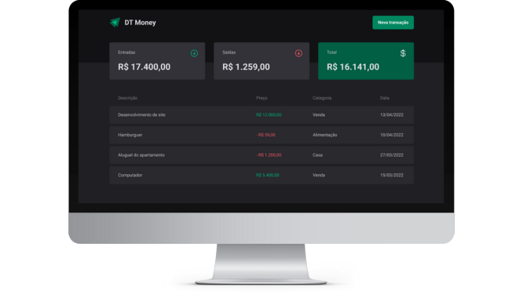

<h1 align="center">
  
</h1>

<br>

<h4 align="center">

    🚧 DT-Money💲
    🚧 Em Desenvolvimento 🔨
</h4>

<br>

## 💻 Sobre o projeto
O DT-Money é uma aplicação criada em React que tem o intuito de ajudar no controle das finanças pessoais. O site contém para isso, um painel de controle que mostra o total de saídas e entradas do indivíduo, assim como uma tabela com todo o fluxo de ganhos e gastos.

---
<br>

## ⚙️ Funcionalidades
- [ ] visualizar o resumo de transações
- [ ] adicionar uma nova transação
- [ ] remover uma transação

---
<br>

## 🎨 Layout
<div align="center">
  
</div>

---
<br>

## 🚀 Como executar o projeto

### Pré-requisitos
Para executar o projeto você irá precisar ter instalado algumas ferramentas em sua máquina:
[Git](https://git-scm.com/), [Node.js](https://nodejs.org/)

### 🏁 Rodando a aplicação Web
```bash
# Clone este repositório
$ git clone https://github.com/thegabrielrodrigues/dt-money.git

# Acesse a pasta do projeto
$ cd dt-money

# Instale o yarn caso não esteja instalado
$ npm install -g yarn

# Instale as dependências
$ yarn install

# Execute a aplicação
$ yarn run dev
```
